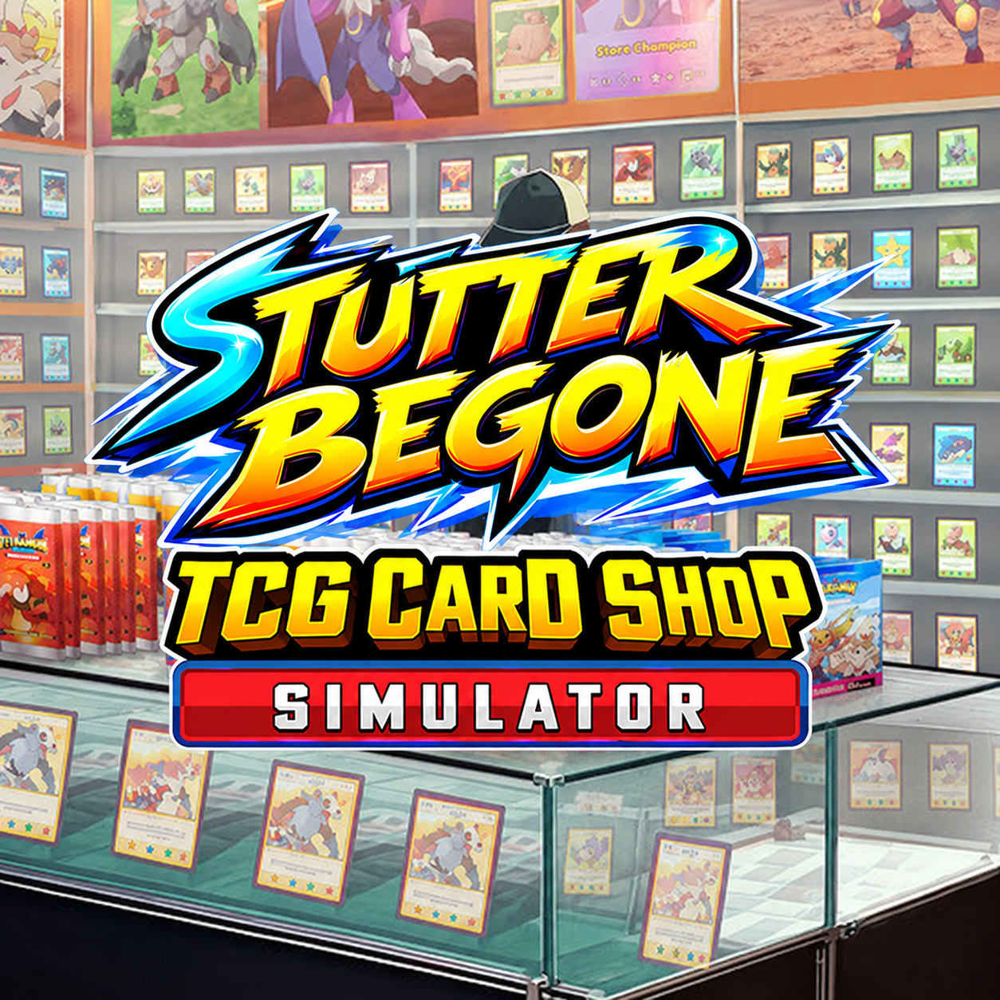

<div align="center">



# StutterBegone

Fixes stuttering when sweeping your mouse over shelves and other items in TCG Card Shop Simulator.

</div>

## Why

The game pools **every** full-screen UI under one shared `ScreenSpaceOverlay` canvas
(`Canvas`). With a full mod set that canvas holds ~144,000–150,000 `CanvasRenderer`
components (only ~50–140 active at a time):

| Subtree | CanvasRenderers | Notes |
|---|---|---|
| `CheckPriceScreen_Grp` | ~47,800 | vanilla screen, grown by EPL (one panel per card/item) |
| `RestockItemScreen_Grp` | ~26,700 | vanilla screen, **path-referenced by EPL/ShopOS** |
| `RestockItemBoardGameScreen_Grp` | ~26,700 | vanilla screen, grown by EPL |
| `PlayCardSetUIScreenGrp` | ~10,800 | |
| `DeckEditCanvasGrp` | ~5,800 | |
| `FurnitureShopUIScreen_Grp` | ~4,700 | |
| … ~50 more screens … | | |

Unity invalidates and rebuilds at the **canvas** granularity, so anything that dirties that
canvas pays the full ~144k cost. Two things dirty it:

1. **The tooltip** (per-frame churn) — every hover over a shelf item adds/removes tooltip
   elements, rebuilding the canvas ~100x/sec.
2. **The big screens** — opening/interacting with a screen rebuilds all ~144k.

This plugin reparents **every** top-level screen onto its own tiny canvas,
so a change only rebuilds that screen's canvas. A tooltip transition then rebuilds ~20
elements instead of ~144k → the hover stutter is gone. **Tooltips stay fully visible.**

## How it works

For each top-level child of the shared canvas (in original sibling order):

1. Create a new root `ScreenSpaceOverlay` canvas named `StutterBegone_<screen>`.
2. Set `sortingOrder = BaseSortingOrder + (original sibling index)`. This preserves the
   **exact original layering** — an overlay that was in front of a screen (e.g. the shopping
   cart) stays in front of it after both are moved.
3. Copy the shared canvas's `CanvasScaler` (so it renders identically).
4. Add a `GraphicRaycaster` (so the UI stays clickable) and register it with the game's
   `RaycasterManager` so the game's `SetUIRaycastEnabled` toggles it with the rest.
5. Move the screen onto the new canvas.

Screens listed in `ExcludeNames` are left on the shared canvas.

## Runtime canvas watcher

Some mods build overlays at runtime (e.g. `Binder Overhaul`'s filter/sort modal). These new
canvases land **below** the reparented screens (which sit at `BaseSortingOrder`+), so the mod's
UI ends up hidden behind a screen. Set a key in `RescanCanvasesKey` (no default) and press it
to scan for new top-level canvases created after the split and shift each to `BaseSortingOrder
+ (top-level child count) + its own sortingOrder`, which lands it above all our screens while
preserving the relative order among mod-created canvases.

## Config (`BepInEx/config/hecrj.stutter.begone.cfg`)

| Key | Default | Meaning |
|---|---|---|
| `Enabled` | `true` | Master switch. |
| `GiantCanvasName` | `Canvas` | The shared canvas to split (falls back to the biggest canvas). |
| `ExcludeNames` | *(empty)* | Comma-separated screen names to leave on the shared canvas. Empty = reparent everything. Add a name here if a screen breaks. |
| `ApplyDelayFrames` | `10` | Extra frames to wait after the canvas is found, before the settle wait begins. |
| `BaseSortingOrder` | `100` | Base `sortingOrder`; each moved screen gets this + its original sibling index. |
| `ProbeInterval` | `30` | Frames between canvas-size samples while waiting for the UI to finish building. |
| `SettleFrames` | `240` | How long the element count must be unchanged before splitting. |
| `MaxWaitFrames` | `900` | Give up the settle wait after this and split anyway (also scales the loading-done hard cap). |
| `MinTotalCanvasRenderers` | `5000` | The canvas must reach this many CanvasRenderers before it counts as "built". |
| `UseEplSignal` | `true` | Use EPL's `OnBundleLoadingComplete` event to detect the end of loading. |
| `RescanCanvasesKey` | `None` | Key to press to rescan for new runtime canvases (e.g. a mod's overlay/modal) and shift them above the reparented screens. No default; set a key to enable. |

> **Timing (two gates).** The loading screen can last well over 15 s; during it the shared
> canvas only holds the base UI. The plugin waits for (1) EPL's `OnBundleLoadingComplete`
> (hot/cold, linked directly to `EnhancedPrefabLoader.API` per the EPL guide; falls back to
> canvas size if no EPL) and then (2) the element
> count to **settle** (unchanged for `SettleFrames`), because the shop panels are added after
> loading. Log: `subscribed to EPL OnBundleLoadingComplete` → `EPL OnBundleLoadingComplete
> fired` → `building: …` → `CENSUS BEFORE` / `CENSUS AFTER`.

## Known reference constraints (why you may need to exclude a screen)

Some code locates screens **by path or as a direct child of the shared canvas**:

- `GameObject.Find("Canvas/RestockItemScreen_Grp")` — EPL + ShopOS, **once at custom-shop
  setup** (to clone the vanilla restock screen). Runs before the split, so it's usually safe
  to reparent — but it's the one to exclude first if a custom shop misbehaves.
- `this.transform.parent.Find("RestockItemAddToCartScreen")` / `…("RestockItemCheckoutScreen")`
  — EPL/CollectionTracker, in the **custom shop clone's `Awake()`**, which runs when the shop
  is first **opened** (at runtime, after the split). Reparenting the cart/checkout can null
  these. Exclude `RestockItemAddToCartScreen` and `RestockItemCheckoutScreen` if a custom
  shop's cart stops working.

If a screen breaks, add its **exact name** (the top-level child name, see the `REPARENT '…'`
log lines) to `ExcludeNames` and restart.

## Uninstall

Delete `BepInEx/plugins/StutterBegone/`. No game or mod files are modified.

## Building

```
dotnet build -c Release -p:GameDir="C:/path/to/TCG Card Shop Simulator" -o out
```
Deploy `out/StutterBegone.dll` to `BepInEx/plugins/StutterBegone/`.

## EPL dependency

This plugin links `EnhancedPrefabLoader.API.dll` (per the [EPL guide](https://prefabloader-187e53.gitlab.io/index.html))
and declares EPL as a **soft dependency** (`[BepInDependency("EnhancedPrefabLoader", SoftDependency)]`).
It uses `Epl.Api.Events.OnBundleLoadingComplete` to time the split. If EPL is not installed, the
plugin still loads and falls back to canvas-size heuristics (the `UseEplSignal` path).
